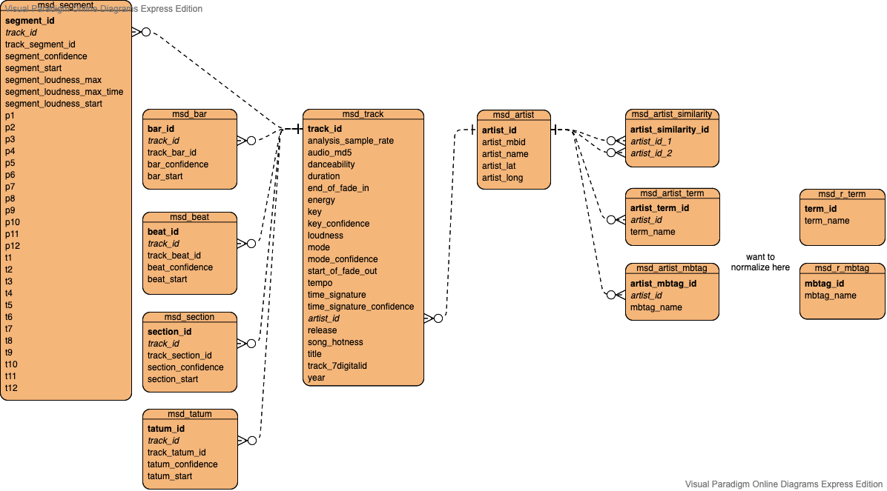
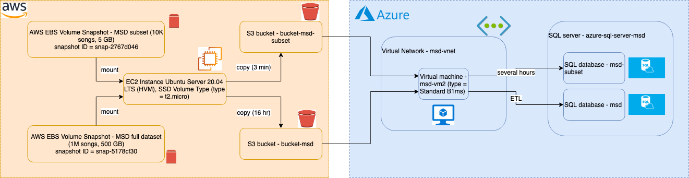

# 3 - Cloud Pipeline with AWS and Azure

## 3.1 - Purpose of the Cloud Pipeline
The purpose of this pipeline was to create a similar structure as the <em>Local Pipeline</em>, but using an Azure database as the destination.
There are a few major differences with this approach:
1. The source dataset comes from AWS
2. An Azure Virtual Machine (VM) is required to run the Python SQLAlchemy script
3. Azure SQL Database (which is SQL Server) is used instead of MySQL

## 3.2 - Database Design
The ERD for the Azure SQL Database is the same as the MySQL database in the <em>Local Pipeline</em>. Here it is again for reference:


## 3.3 - Pipeline Design
Here is the dataflow for the cloud pipeline:


Getting the dataset from AWS is not as straightforward as downloading it directly to Azure. Since the dataset is stored as an AWS EBS snapshot, it must be mounted onto an EC2 instance and then downloaded to an S3 bucket. Only then can Azure access the data from AWS.

## 3.4 - Code
code/s3-to-azure-msd-subset.py - this script is what the Azure VM uses to retrieve data from AWS S3, and then use SQLAlchemy to transform the data into tables that get loaded into Azure SQL Database

## 3.5 - How to reproduce this pipeline
This section is divided into 2 parts:
1. getting the AWS snapshot into an S3 bucket
2. processing the data from S3 to the Azure SQL Database

### 3.5.1 - AWS EBS Snapshot -> AWS S3
- in your AWS account, create an S3 bucket
- spin up a basic Ubuntu EC2 instance
- give the EC2 instance the role <em>AmazonS3FullAccess</em>
- search for the EBS Snapshot with Snapshot ID = snap-2767d046
- Select the snapshot and create a volume from it. Make sure you give the volume the same Availability Zone as the EC2 instance.
- Attach the volume to the EC2 instance. Take note of the mount drive (e.g. "/dev/xvdg").
- connect to the EC2 instance via EC2 Instance Connect
- mount the snapshot drive and verify its contents (change mount drive if yours is different):
```
sudo mkdir /mnt/snap
sudo mount -t ext4 /dev/xvdg /mnt/snap
ls /mnt/snap
```
- copy entire folder contents to your S3 bucket (takes about 3 minutes):
```
sudo apt update
sudo apt install awscli
aws s3 cp --recursive /mnt/snap s3://<bucket-name>
```
- verify the contents in your S3 bucket
- delete the EC2 instance and EBS volume as they are no longer needed

### 3.5.2 - AWS S3 -> Azure SQL Database
- in your Azure account, create a SQL server
- in the SQL server, create a SQL database with around 5 GB of storage
- create a Virtual network
- spin up a VM of size at least as big as <em>Standard B1ms (1 vcpus, 2 GiB memory)</em> and add it to the Virtual network
- reserve the VM's public IP address so that it does not change everytime the VM restarts
- back in the SQL server, add the VM's public IP address to the firewall settings so that the VM can send data to the database
- Connect to the VM. I used Visual Studio Code, an editor that allows you to ssh to the VM. You just need to provide the VM's public IP address.
- 
