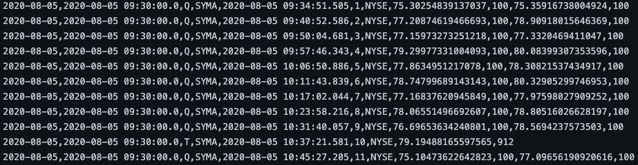
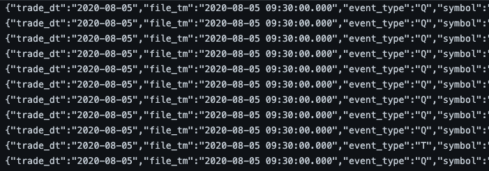

# 1 - Background

## 1.1 - Objective
The second capstone in Springboard's Data Engineering bootcamp was a "guided" capstone. The problem statement was provided and the following technologies were used: Azure Blob Storage, Azure Databricks, PySpark DataFrames & SQL, Parquet files.

## 1.2 - Topic
This project involves an ETL that takes NASDAQ and NYSE data from Azure Blob Storage, transforms them in Azure Databricks, then writes the final output back to Blob Storage. The data are stock price transactions, most of which are quoted prices and some of which are actual traded prices. The purpose of the ETL is to transform the data in a way that results in just the quotes, with the most recent trades and yesterday's closing trade as extra columns. The following sections will make this more clear.

## 1.3 - Datasets
All input data can be found in [data](data), which I also have in Azure Blob Storage. These are the initial data that our ETL will process from.

There is a separate folder for each stock exchange, and within 2 separate date folders (20200805, 20200806). At the child level, you can examine what each of the data files looks like. For NYSE, note that they are text files with comma-separated values while NASDAQ has a json format. Though they are formatted differently, they contain the same type of data.

NYSE example:

NASDAQ example:

# 2 - ETL

## 2.1 - ETL Architecture
The following diagram is a visual for the ETL. We will go through each of the stages.

## 2.2 - ETL Stage 1
The code for Stage 1 is contained in the Azure Databricks notebook [guidedcapstonestep2_accesskeyhidden.ipynb](code/guidedcapstonestep2_accesskeyhidden.ipynb).

This notebook is a PySpark script which I've hosted on an Azure Databricks cluster and does the following:
* creates a file mount so that the cluster has access to the Blob Storage
* partitions the NASDAQ and NYSE data into quotes and trades (and bad data, if there are any)
* structure the partitions into dataframes with well-defined schemas
* write the partitions on the cluster as parquet files

## 2.3 - ETL Stage 2
The code for Stage 2 is contained in the Azure Databricks notebook [guidedcapstonestep3_accesskeyhidden.ipynb](code/guidedcapstonestep3_accesskeyhidden.ipynb).

This notebook cleans the data of any duplicate entries and writes the cleaned, partitioned parquet files back to Blob Storage.

## 2.4 - ETL Stage 3
The code for Stage 3 is contained in the Azure Databricks notebook [guidedcapstonestep4_accesskeyhidden.ipynb](code/guidedcapstonestep4_accesskeyhidden.ipynb).

This notebook does the following:
* pulls today's quote and trade parquet files, and yesterday's trade parquet file into the cluster
* for each of today's quotes, append the latest trade that occurred before that quote into a new column
* append the previous day's closing trade into a new column
* write the final parquet files back to Blob Storage

# 3 - How to reproduce
* Azure Storage setup
  * in your Azure account, create a resource group for this project
  * create a storage account with a Blob container in it
  * In the container, upload the data folder. Ensure the nested structure of the folder is maintained in Azure (e.g. <em>data/input/nasdaq/20200805</em>)
  * take note of your storage account name, storage account access key, and Blob container name
* Azure Databricks setup
  * in your resource group, create an Azure Databricks Service
  * Create a cluster with minimal compute power. I used the following settings:
    * Cluster Mode = Standard
    * Databricks Runtime Version = 7.5 (includes Apache Spark 3.0.1, Scala 2.12)
    * Enable autoscaling
    * Terminate after 60 minutes of inactivity
    * Worker Type = Standard_DS3_v2 (14.0 GB Memory, 4 Cores, 0.75 DBU) with 2-8 workers
    * Driver Type = Same as worker
  * once the cluster is running, upload all the notebooks from the folder [code](code)
  * in each of the notebooks, update the storage account name, storage account access key, and Blob container name with yours
* running the ETL
  * option 1: run each notebook sequentially and observe the intermediate stages of the Blob container and Databricks cluster
  * option 2: run the notebook [run-guidedcapstone.ipynb](code/run-guidedcapstone.ipynb) to trigger the entire ETL
