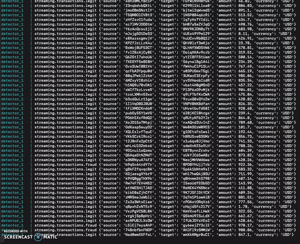
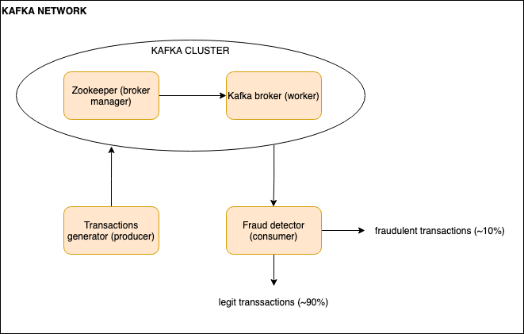

# Kafka Mini-Project
This project demonstrates the use of a single-broker Apache Kafka infrastructure using Docker. A producer will stream any number of fake credit card transactions to the Kafka cluster, which a consumer will then process as legit or fraudulent. Since the focus of this project is on Kafka infrastructure, the fraudulence detector has a trivial algorithm of designating the top 10% of transactions as fraud.

# How you can replicate this project
* download docker and docker-compose
* download this directory
* in this directory, create a Kafka network: `$ docker network create kafka-network`.
    * in this project, the Zookeeper and broker containers will be spun up as one group, while the producer and consumer will be spun up as another group (notice the 2 docker-compose files)
    * this network allows these 2 groups to communicate with each other
* start the Kafka cluster: `$ docker-compose -f docker-compose.kafka.yml up`
* in a new terminal, start the producer/consumer: `$ docker-compose -f docker-compose.yml up`
    * once up, you should see the terminal printing the output back and forth between the producer and consumer
* to view just the continous stream of transactions generated by the producer, in a new terminal: `$ docker-compose -f docker-compose.kafka.yml exec broker kafka-console-consumer --bootstrap-server localhost:9092 --topic queueing.transactions --from-beginning`
* to view just the continous stream of transactions designated as legit by the consumer, in a new terminal: `$ docker-compose -f docker-compose.kafka.yml exec broker kafka-console-consumer --bootstrap-server localhost:9092 --topic streaming.transactions.legit`
* to view just the continous stream of transactions designated as fraudulent by the consumer, in a new terminal: `$ docker-compose -f docker-compose.kafka.yml exec broker kafka-console-consumer --bootstrap-server localhost:9092 --topic streaming.transactions.fraud`
* to change the # transactions generated per second:
    * stop the producer/consumer group: Ctrl+C
    * in docker-compose.yml, increase TRANSACTIONS_PER_SECOND to 1000, for example
    * rebuild the producer/consumer containers and note the difference!: `$ docker-compose -f docker-compose.yml up --build`
* stop the cluster: Ctrl+C or `$ docker-compose down`

# Architecture Diagram

