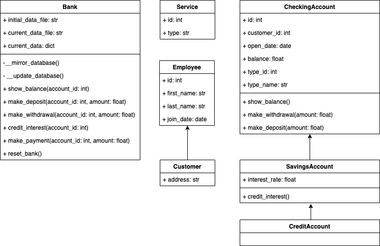

# Mini-Project 1: OOP in Python
This assignment contains a basic banking model using object-oriented programming (OOP) in Python.
It contains a sample set of customer banking accounts that you can update with OOP.

### Data Storage
For simplicity, all the data that is used in this example is saved in a json file.

### UML
This UML diagram shows what classes are created as part of the assignment. Some inherited
methods get overridden. For example, the CreditAccount class will override its
make_withdrawal method because we don't expect withdrawals to apply to credit card balances.

### Usage
The file bank_database_INITIAL_STATE.json represents the initial state of the bank. It
contains a few customers and a group of accounts among these customers that include at least
one of each of the types of accounts at this bank: checking, savings, credit.

When bank.py is run for the first time, a copy of this file will be saved as bank_database.json.
bank_database.json represents the current state of the bank and will be updated as we make
changes to accounts.

Begin by initializing a Bank object:
  >>> my_bank = Bank()

Below are the possible actions you can make with this bank.

1. Show the balance of an account (any type)
  >>> my_bank.show_balance(3)
  SAVINGS ACCOUNT
  Current balance: $3000

2. Withdraw from an account (checking/savings)
  >>> my_bank.make_withdrawal(4, 100)
  CHECKING ACCOUNT
  Balance before transaction: $5000
  Transaction amount: $100
  ...PROCESSING...
  Remaining balance: $4900

3. Deposit into an account (checking/savings)
  >>> my_bank.make_deposit(1, 200)
  CHECKING ACCOUNT
  Balance before transaction: $1000
  Transaction amount: $200
   ...PROCESSING...
  Remaining balance: $1200

4. Credit interest to an account (savings/credit)
  >>> my_bank.credit_interest(5)
  CREDIT ACCOUNT
  Balance before interest credit: $500
  Interest rate: 20.0%
   ...PROCESSING...
  Remaining balance: $600.0

5. Make a payment to an account (credit)
  >>> my_bank.make_payment(5, 300)
  CREDIT ACCOUNT
  Balance before transaction: $600.0
  Transaction amount: $300
   ...PROCESSING...
  Remaining balance: $300.0

6. Reset bank to the initial state. WARNING: this will erase any updates you make
to your bank.
  >>> my_bank.reset_bank()